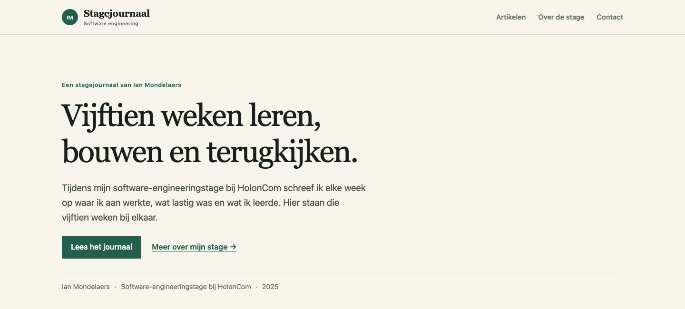

# Software Engineering Internship Journal

[](https://github.com/DenGian/blog/actions/workflows/ci.yml) [](LICENSE) · [Live site](https://holoncom-blog.vercel.app/)

A deployed Dutch internship journal and a protected single-admin CMS. Live at [holoncom-blog.vercel.app](https://holoncom-blog.vercel.app/). Fifteen original weekly articles document Ian Mondelaers’ workplace learning at HolonCom; the application around them is a production-minded Next.js portfolio project.

The articles are intentionally kept in Dutch and are not rewritten by the platform.



## What is implemented

- App Router with server components by default and bounded dynamic MongoDB reads
- Dutch article index, safe search, tag filters, pagination, reading time, adjacent navigation, print styles, and resilient cover images
- Encrypted server-side admin session, bcrypt password verification, origin checks, and authorization on every mutation
- Draft, preview, publish, unpublish, edit, collision-safe slug, and explicit delete workflows
- Shared Zod validation and restrictive server-side rich HTML sanitization
- TipTap 3 editor with unsaved-change protection
- Fifteen original local SVG covers plus Cloudinary-ready media with owned/licensed HTTPS fallback
- Canonical metadata, Open Graph article data, JSON-LD, sitemap, robots rules, and Atom feed
- Security headers, CSP, strict TypeScript, ESLint, Prettier, Vitest, Playwright specifications, and CI
- Read-only content export plus opt-in, dry-run-first migration tooling

## Architecture

The project uses Next.js 16, React 19, TypeScript 6, MongoDB/Mongoose, TipTap, Zod, sanitize-html, iron-session, and bcryptjs.

```text
src/app          routes, server-rendered pages, mutation handlers
src/auth         sessions, authorization, origin and rate-limit controls
src/data         bounded database queries and document-to-view mapping
src/domain       validation, sanitization, slugging, search and reading time
src/components   public and admin presentation
src/media        upload-provider boundary
scripts          export, credential hashing and manual migration
```

Important decisions are recorded in [`docs/architecture`](docs/architecture). Automatic Mongoose index creation is disabled. Legacy posts with no status remain public until the manual migration adds explicit publication state; all new posts default to draft.

## Security model

The browser never receives or compares the admin credential. `ADMIN_PASSWORD_HASH` and `SESSION_SECRET` are server-only. Iron Session issues an encrypted `HttpOnly`, `SameSite=Strict` cookie with an eight-hour lifetime; production cookies are `Secure`. Protected layouts guard pages, while every create, update, publish, unpublish, and delete route independently checks the session and request origin.

Production admin login is disabled until durable Upstash rate limiting is configured. The in-memory development fallback is intentionally not described as production-safe. Rich HTML is sanitized on both read and write. Search terms are escaped and capped; page sizes, identifiers, tags, fields, and request bodies are constrained.

The former `NEXT_PUBLIC_ADMIN_PASSWORD` must be treated as compromised if any legacy build was deployed. Never reuse it.

## Local setup

Requirements: Node.js 22 and access to a MongoDB database. Never point tests or E2E mutation runs at the existing production database.

```bash
nvm use
npm ci
cp .env.example .env.local
npm run auth:hash
npm run dev
```

`npm run auth:hash` reads a password from standard input and emits only its bcrypt hash. A shell can pass hidden input with `read -s` and a pipe. Generate `SESSION_SECRET` with a cryptographically secure generator and store it only in `.env.local` or the deployment secret manager.

### Environment variables

| Name                             | Scope  | Required       | Purpose                                              |
| -------------------------------- | ------ | -------------- | ---------------------------------------------------- |
| `MONGODB_URI`                    | server | yes            | Least-privilege MongoDB connection string            |
| `MONGODB_DATABASE`               | server | production     | Database name; defaults to `blog_portfolio`          |
| `SITE_URL`                       | server | production     | `https://holoncom-blog.vercel.app`                   |
| `ADMIN_PASSWORD_HASH`            | server | for CMS        | bcrypt hash for the sole administrator               |
| `SESSION_SECRET`                 | server | for CMS        | At least 32 random characters for session encryption |
| `UPSTASH_REDIS_REST_URL`         | server | production CMS | Durable login throttling endpoint                    |
| `UPSTASH_REDIS_REST_TOKEN`       | server | production CMS | Durable login throttling token                       |
| `CLOUDINARY_CLOUD_NAME`          | server | optional       | Cloudinary account name                              |
| `CLOUDINARY_API_KEY`             | server | optional       | Signed upload API identifier                         |
| `CLOUDINARY_API_SECRET`          | server | optional       | Signed upload secret                                 |
| `NEXT_PUBLIC_GISCUS_REPO`        | public | optional       | Public `owner/repository` name                       |
| `NEXT_PUBLIC_GISCUS_REPO_ID`     | public | optional       | Giscus repository identifier                         |
| `NEXT_PUBLIC_GISCUS_CATEGORY`    | public | optional       | Discussions category                                 |
| `NEXT_PUBLIC_GISCUS_CATEGORY_ID` | public | optional       | Giscus category identifier                           |
| `NEXT_PUBLIC_GITHUB_URL`         | public | optional       | Verified author GitHub profile                       |
| `NEXT_PUBLIC_LINKEDIN_URL`       | public | optional       | Verified author LinkedIn profile                     |

Only values explicitly prefixed `NEXT_PUBLIC_` enter the browser bundle. Password hashes, session keys, database credentials, and rate-limit tokens must never use that prefix.

Site URL resolution is deliberate: a Vercel Preview uses its HTTPS `VERCEL_URL` so protected mutations and preview metadata share the deployed origin; Production prefers `SITE_URL`, then `VERCEL_PROJECT_PRODUCTION_URL`, then `VERCEL_URL`; non-Vercel development prefers `SITE_URL` and otherwise uses `http://localhost:3000`. Vercel supplies those system hostnames without a scheme when system environment variables are exposed. Production rejects HTTP, loopback, credential-bearing, and placeholder origins.

## Content safety and migration

Create a local, ignored, primary/majority read-only export before any migration. The export is written atomically and receives a `.sha256` sidecar. The checksum detects changes to that local file after export; because it is generated by the same command, it is not independent proof that an external backup or restore is safe.

```bash
npm run content:export
npm run content:migrate
npm run content:indexes
```

The second command is always a dry run. It reports proposed changes without writing. A future manual apply requires both an explicit flag and a verified backup:

```bash
npm run content:migrate:apply -- --backup .local-backups/posts-<timestamp>.json
npm run content:indexes:apply -- --backup .local-backups/posts-<timestamp>.json
```

Reports use the unambiguous modes `MIGRATION_DRY_RUN`, `MIGRATION_APPLY`, `INDEX_DRY_RUN`, and `INDEX_APPLY`. Apply verifies the sidecar, metadata, required fields, duplicates, and exact target identities before writing. Do not run either apply command against the existing database until the owner has reviewed the dry-run report and scheduled a maintenance window.

## Cover media and licensing

The fifteen legacy slugs render project-original, code-native SVG illustrations from `public/covers/`; they were created specifically for this journal and contain no copied photos, logos, fonts, raster data, or external resources. A typed slug map overrides the old database URLs immediately. The optional migration later stores those local paths without downloading or redistributing the former remote images.

Only upload or reference media you own or are licensed to publish. Prefer local project assets or configured Cloudinary delivery. An arbitrary HTTPS field remains available for appropriately licensed media, but it is not permission to hotlink third-party sites.

## Quality commands

```bash
npm run format:check
npm run lint
npm run typecheck
npm test
npm run test:e2e
npm run build
npm audit
```

By default, `npm run test:e2e` starts a loopback-only temporary `mongod` on a test-only database, seeds deterministic fixtures, starts the real application with test credentials, runs all browser scenarios, drops and verifies removal of that database, stops every child, and removes its temporary files. It requires local `mongod` and Playwright Chromium (`npx playwright install chromium`). In CI, `E2E_MONGODB_URI=mongodb://127.0.0.1:27017` selects the MongoDB instance supplied by the workflow: the runner creates a unique `journal_e2e_ci_*` database, drops and verifies only that database, and never stops the external server. The dedicated variable rejects credentials, non-loopback hosts, URI database names/options, and production-like targets; the runner never falls back to application `MONGODB_URI`.

## Optional integrations

Cloudinary and Giscus are disabled gracefully when not configured. Giscus needs GitHub Discussions, the Giscus app, and the four public identifiers; Discussions are disabled, so comments remain unavailable until a separate setup decision. EmailJS was removed: a static contact page with verified GitHub and LinkedIn links is more credible than an unmonitored browser-side mail form.

The complete internship PDF was not present during the overhaul. Add the real document at `public/internship-journal.pdf` and then expose the download link; no fabricated placeholder is shipped.

## Deployment

The site is deployed on Vercel. On 24 September 2026, the production site served all 15 original article URLs, all 15 local covers, the sitemap, and the feed. See the [deployment runbook](docs/deployment-runbook.md) and [public-release checklist](docs/public-release.md) for configuration and release checks. Do not run the migration to repair a missing or failing production connection.

## Limitations and next steps

- Durable rate limiting, media uploads, and comments require external configuration.
- The migration and index apply modes have not been run against the existing database.
- Production admin login and secret rotation require owner verification before they are described as operational.
- Optional Cloudinary uploads and Giscus comments are not confirmed configured; production admin login is currently unavailable.
- No analytics or contact-data collection is included.

## License and portfolio context

The application source code is available under the MIT License. Written internship articles, personal photographs, and other original personal media remain © Ian Mondelaers and are not licensed under MIT. See [`LICENSE`](LICENSE) for the standard MIT code license and [`CONTENT_LICENSE.md`](CONTENT_LICENSE.md) for the content boundary.
